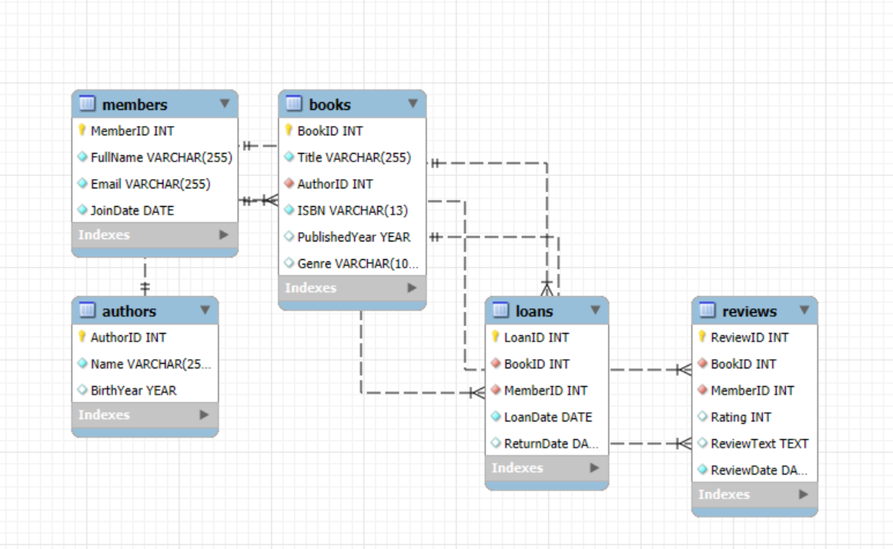

# MySQL Database Project

## Project Title
MySQL Database Management System for Library Management

## Description
This project implements a full-featured relational database for managing a library system. It includes functionalities for tracking books, authors, members, and loans. The database schema is designed to ensure data integrity and efficient querying through the use of proper constraints and relationships.

## How to Run/Setup the Project
1. Ensure you have MySQL installed on your machine.
2. Open your MySQL command line or a MySQL client (like MySQL Workbench).
3. Create a new database using the following command:
   ```sql
   CREATE DATABASE library_management;
   ```
4. Use the newly created database:
   ```sql
   USE library_management;
   ```
5. Import the SQL schema by executing the contents of the `sql/database-schema.sql` file. You can do this by running:
   ```sql
   SOURCE path/to/sql/database-schema.sql;
   ```
   Replace `path/to/sql/` with the actual path to the `sql` directory.

## Entity-Relationship Diagram (ERD)
 

This diagram visually represents the database schema and the relationships between the tables.